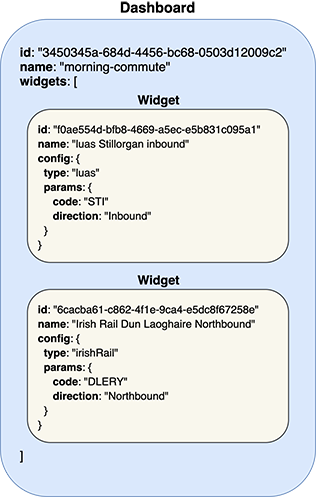

# realtime-transport-dashboards

[](https://dev.azure.com/loige/loige/_build/latest?definitionId=3&branchName=master)
[](https://standardjs.com)

Serverless APIs for AWS to build and display Irish public transports real time data.

This is a sample serverless application that can be used for workshops or other educational purposes.


The application allows you to create **dashboards**. Every dashboard can contain 0 or more **widgets**. A widget can display real time information about a specific Dublin Bus stop, a LUAS stop or a Irish Rail station.

An example of a dashboard in terms of data structure:

[](./images/dashboard-example.png)


The application offers [APIs](#apis) to create, edit and visualize dashboards and widgets.


## Getting started

Before starting make sure you have the [AWS CLI installed](https://aws.amazon.com/cli/) and properly [configured](https://docs.aws.amazon.com/cli/latest/userguide/cli-chap-configure.html).

You will also need [Node.js](https://nodejs.org/en/) version 8+.

Now clone this repository in your local workspace and run the following command to install the necessary dependencies:

```bash
npm install
```

Now you can deploy the service to your local AWS account with the following command:

```bash
npm run deploy
```

If everything went fine you should see the URL for the deployed API endpoints.


## APIs

Once you deploy the functions you will be able to access the following APIS:

 - [createDashboard](#createDashboard): creates a new dashboard
 - [updateDashboard](#updateDashboard): updates an existing dashboard
 - [deleteDashboard](#deleteDashboard): deletes an existing dashboard
 - [getDashboard](#getDashboard): get data for a dashboard and real time information for every widget
 - [addWidget](#addWidget): adds a new widget to an existing dashboard
 - [updateWidget](#updateWidget): updates an existing widget
 - [deleteWidget](#deleteWidget): deletes an existing widget from a dashboard

To run the examples, export your API endpoint prefix as `PREFIX`, for instance:

```bash
PREFIX="https://<api_gate_way_id>.execute-api.eu-west-1.amazonaws.com/prod"
```

Make sure to replace `<api_gate_way_id>` with you actual deployment id.

<a id="createDashboard"></a>
---

### ⚡️ createDashboard

Creates a new dashboard.


#### Endpoint

```
POST `/dashboard`
```


#### Payload

```json
{
  "name": "<string>"
}
```

#### Example

```bash
curl -XPOST -i -H "Content-Type: application/json" -d '{"name":"my-dashboard"}' "${PREFIX}/dashboard"
```

Example Output:

```plain
HTTP/2 200
content-type: application/json

{
  "id":"d733b0b2-f429-4bdf-82ab-c9fc3b3190d7",
  "name":"my-dashboard",
  "createdAt":"2019-09-29T09:06:17.698Z",
  "updatedAt":"2019-09-29T09:06:17.698Z",
  "widgets":[]
}
```


<a id="updateDashboard"></a>
---

### ⚡️ updateDashboard

Updates an existing dashboard. It basically allows you to change a dashboard name.


#### Endpoint

```
POST `/dashboard/{dashboard_id}`
```


#### Payload

```json
{
  "name": "<string>"
}
```

#### Example

```bash
curl -XPOST -i -H "Content-Type: application/json" -d '{"name":"new-name"}' "${PREFIX}/dashboard/d733b0b2-f429-4bdf-82ab-c9fc3b3190d7"
```

Example Output:

```plain
HTTP/2 200
content-type: application/json
content-length: 154

{
  "createdAt":"2019-09-29T13:14:47.299Z",
  "widgets":[],
  "id":"d733b0b2-f429-4bdf-82ab-c9fc3b3190d7",
  "name":"new-name",
  "updatedAt":"2019-09-29T13:15:37.134Z"
}
```


<a id="deleteDashboard"></a>
---

### ⚡️ deleteDashboard

Deletes an existing dashboard


#### Endpoint

```
DELETE `/dashboard/{dashboard_id}`
```


#### Example

```bash
curl -XDELETE -i "${PREFIX}/dashboard/d733b0b2-f429-4bdf-82ab-c9fc3b3190d7"
```

Example Output:

```plain
HTTP/2 200
content-type: application/json
content-length: 0


```


<a id="getDashboard"></a>
---

### ⚡️ getDashboard

Get data for a dashboard and real time information for every widget


#### Endpoint

```
GET `/dashboard/{dashboard_id}`
```


#### Example

```bash
curl -XGET -i "${PREFIX}/dashboard/d733b0b2-f429-4bdf-82ab-c9fc3b3190d7"
```

Example Output:

```plain
HTTP/2 200
content-type: application/json
content-length: 401

{
  "createdAt":"2019-09-28T14:12:03.196Z",
  "widgets":
  [
    {
      "config":{
        "type":"luas",
        "parameters":{
          "code":"STI",
          "direction":"Inbound"
        }
      },
      "id":"6cacba61-c862-4f1e-9ca4-e5dc8f67258e",
      "name":"Stillorgan LUAS inbound",
      "realtimeInfo":
      [
        {
          "direction":"Inbound",
          "destination":"Broombridge",
          "arrivingInMinutes":9,
          "expectedArrivalTime":"2019-09-29T11:59:39.000+01:00"
        }
      ]
    }
  ],
  "id":"d733b0b2-f429-4bdf-82ab-c9fc3b3190d7",
  "name":"new-name",
  "updatedAt":"2019-09-28T16:43:05.570Z"
}
```


<a id="addWidget"></a>
---

### ⚡️ addWidget

Adds a new widget to an existing dashboard


#### Endpoint

```
POST `/dashboard/{dashboard_id}/widget`
```

#### Payload

```json
{
  "name": "<string>",
  "config": {
    "type": "irishRail | dublinBus | luas",
    "parameters": {
      "code": "<string>",
      "direction": "<string> (optional - only for irishRail and luas)"
    }
  }
}
```


#### Example

Adds a widget to monitor the Luas Dominick stop Inbound:

```bash
curl -XPOST -i -H "Content-Type: application/json" -d '{"name": "Luas Dominick Inbound", "config": {"type": "luas", "parameters": {"code": "DOM", "direction": "Inbound"}}}' "${PREFIX}/dashboard/d733b0b2-f429-4bdf-82ab-c9fc3b3190d7/widget"
```

Example Output:

```plain
HTTP/2 200
content-type: application/json
content-length: 151

{
  "name":"Luas Dominick Inbound",
  "config":{
    "type":"luas",
    "parameters":{
      "code":"DOM",
      "direction":"Inbound"
    }
  },
  "id":"59b8a71b-d8c6-4569-9ec8-69c5ff0c7521"
}
```


<a id="updateWidget"></a>
---

### ⚡️ updateWidget

Updates an existing widget


#### Endpoint

```
POST `/dashboard/{dashboard_id}/widget/{widget_id}`
```


#### Payload

```json
{
  "name": "<string>",
  "config": {
    "type": "irishRail | dublinBus | luas",
    "parameters": {
      "code": "<string>",
      "direction": "<string> (optional - only for irishRail and luas)"
    }
  }
}
```


#### Example

Changes the previous widget direction from Outbound to Inbound:

```bash
curl -XPOST -i -H "Content-Type: application/json" -d '{"name": "Luas Dominick Inbound", "config": {"type": "luas", "parameters": {"code": "DOM", "direction": "Outbound"}}}' "${PREFIX}/dashboard/d733b0b2-f429-4bdf-82ab-c9fc3b3190d7/widget/59b8a71b-d8c6-4569-9ec8-69c5ff0c7521"
```

Example Output:

```plain
HTTP/2 200
content-type: application/json
content-length: 151

{
  "createdAt":"2019-09-29T13:14:47.299Z",
  "widgets":[
    {
      "name":"Luas Dominick Inbound",
      "config":{
        "type":"luas",
        "parameters":{
          "code":"DOM",
          "direction":"Outbound"
        }
      },
      "id":"59b8a71b-d8c6-4569-9ec8-69c5ff0c7521"
    }
  ],
  "id":"d733b0b2-f429-4bdf-82ab-c9fc3b3190d7",
  "name":"new-name",
  "updatedAt":"2019-09-29T13:39:10.719Z"
}
```


<a id="deleteWidget"></a>
---

### ⚡️ deleteWidget

Deletes an existing widget from a dashboard


#### Endpoint

```
DELETE `/dashboard/{dashboard_id}/widget/{widget_id}`
```


#### Example

```bash
curl -XDELETE -i "${PREFIX}/dashboard/d733b0b2-f429-4bdf-82ab-c9fc3b3190d7/widget/59b8a71b-d8c6-4569-9ec8-69c5ff0c7521"
```

Example Output:

```plain
HTTP/2 200
content-type: text/plain
content-length: 0


```


## AWS Cleanup

If you want to remove all the resources created by this project from your AWS account you can simply run:

```bash
npm run cleanup
```


## Utilities

This repository contains a number of utility scripts to get information for the supported realtime services:

 - **Get all Dublin Bus stops**: `node utils/allBusStops.js`
 - **Get all Irish Rail stations**: `node utils/allRailStations.js`
 - **Get all Luas stops**: `node utils/allLuasStops.js`


## Contributing

Everyone is very welcome to contribute to this project. You can contribute just by submitting bugs or
suggesting improvements by [opening an issue on GitHub](https://github.com/lmammino/realtime-transport-dashboards/issues) or [PRs](https://github.com/lmammino/realtime-transport-dashboards/pulls).


## License

Licensed under [MIT License](LICENSE). © Luciano Mammino.
